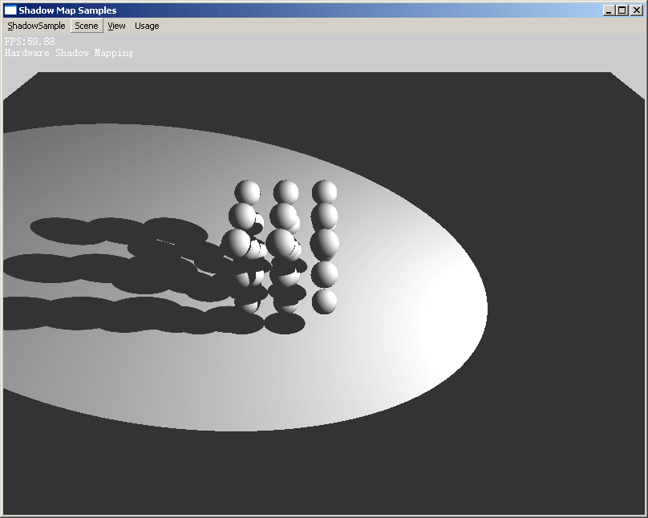

# Casting curved shadows on curved surfaces

- Author: Lance Williams
- Publication: SIGGRAPH '78, August 1978 
- https://dl.acm.org/doi/10.1145/800248.807402
 
 ## 练习代码

- 2008年基于 D3D9 的一个实现：https://github.com/neil3d/ShadowMappingD3D
- 相关博客：https://neil3d.gitee.io/3dengine/shadow-mapping.html

